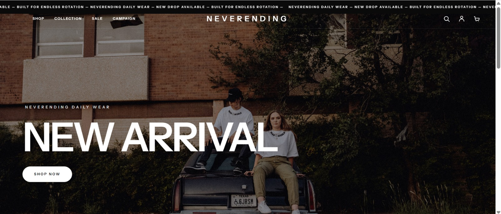
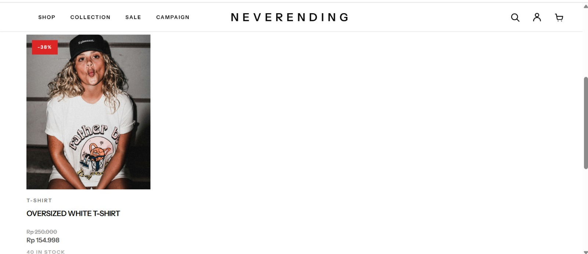
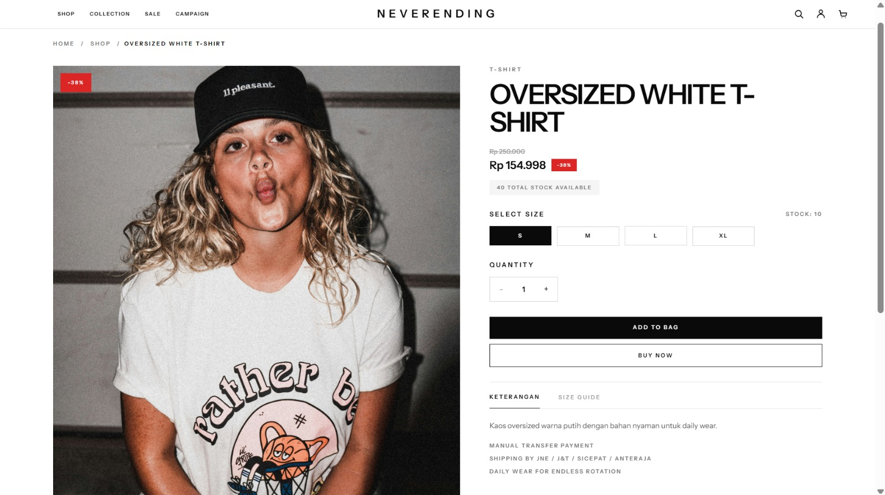
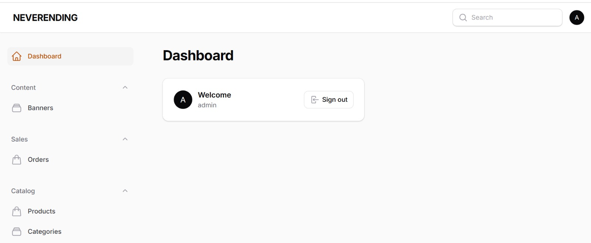

<div align="center">

# NEVERENDING

**Modern daily wear for endless rotation.**

A full-stack e-commerce platform designed to provide a clean shopping experience for customers and an efficient store management workflow for administrators.

[Live Website](https://online-shop-production-b2b5.up.railway.app)

</div>

---

## About NEVERENDING

NEVERENDING is a modern e-commerce platform focused on daily wear products.

The platform allows customers to discover products, manage their shopping bag, complete checkout, upload payment proof, and monitor order progress.

Store administrators can manage products, stock, payments, shipments, banners, and customer orders through a secure administration dashboard.

## Features

### Customer Experience

* Browse active products and categories
* Search and filter products
* View product details, variants, stock, and sale prices
* Add products to the shopping bag
* Update shopping bag quantities
* Manage delivery addresses
* Complete checkout
* Upload payment proof
* View order history
* Monitor order progress
* Register, login, and manage account information

### Store Management

* Secure admin panel powered by Filament
* Manage banners and categories
* Manage products and product descriptions
* Manage regular prices and sale prices
* Manage product images
* Manage product variants and stock
* Review customer payment proof
* Update payment status
* Update order status
* Update shipping status
* Add tracking numbers
* Monitor customer orders

### Reliability and Security

* Admin-only dashboard access
* Customer data ownership protection
* Image upload validation
* Rate limiting for important customer actions
* Automatic stock restoration for failed or cancelled orders
* Prevention of duplicate stock restoration
* Prevention of reactivating released or cancelled orders
* Automated feature and security tests

## Technology Stack

| Area            | Technology                       |
| --------------- | -------------------------------- |
| Backend         | PHP 8.3, Laravel 12              |
| Admin Panel     | Filament 4                       |
| Frontend        | Vue.js, Inertia.js, Tailwind CSS |
| Database        | MySQL                            |
| Asset Bundler   | Vite                             |
| Deployment      | Railway                          |
| Version Control | Git, GitHub                      |

## Screenshots

### Homepage



### Product List



### Product Detail



### Admin Dashboard



## Local Development

### Requirements

* PHP 8.3 or newer
* Composer
* Node.js LTS
* npm
* MySQL

### Installation

Clone the repository:

```bash
git clone https://github.com/radiityy/online-shop.git
cd REPOSITORY
```

Install backend dependencies:

```bash
composer install
```

Install frontend dependencies:

```bash
npm install
```

Copy the environment configuration:

```bash
cp .env.example .env
```

Generate the application key:

```bash
php artisan key:generate
```

Configure the database connection inside `.env`:

```env
DB_CONNECTION=mysql
DB_HOST=127.0.0.1
DB_PORT=3306
DB_DATABASE=your_database_name
DB_USERNAME=your_database_username
DB_PASSWORD=your_database_password

Run database migrations:

```bash
php artisan migrate
```

Create the public storage link:

```bash
php artisan storage:link
```

Build frontend assets:

```bash
npm run build
```

Run the application:

```bash
php artisan serve
```

## Development Commands

Run the Laravel development server:

```bash
php artisan serve
```

Run the Vite development server:

```bash
npm run dev
```

## Testing

Run the backend test suite:

```bash
php artisan test
```

Build frontend production assets:

```bash
npm run build
```

## Deployment

Deployment instructions are available in:

```txt
DEPLOYMENT.md
```

The final launch checklist is available in:

```txt
FINAL-LAUNCH-CHECKLIST.md
```

## Security

Production credentials are not included in this repository.

Do not commit:

* `.env`
* Application keys
* Database credentials
* Admin credentials
* Third-party service credentials
* Customer personal information

Security issues should be reported privately to the project maintainer.

## Project Status

NEVERENDING is actively maintained and prepared for production deployment.

## Maintainer

Developed and maintained by the NEVERENDING team.

---

<div align="center">

**NEVERENDING Built for endless rotation.**

</div>
